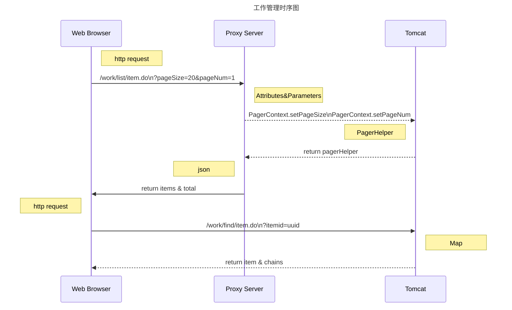
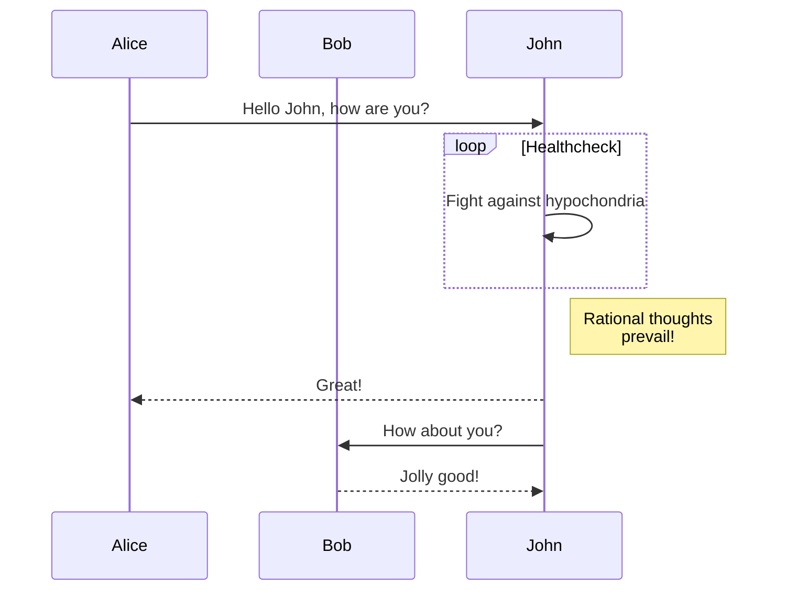
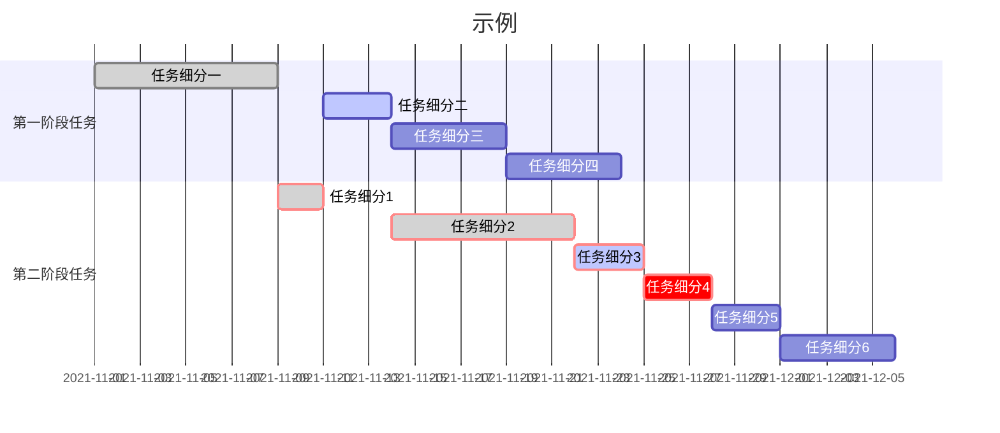
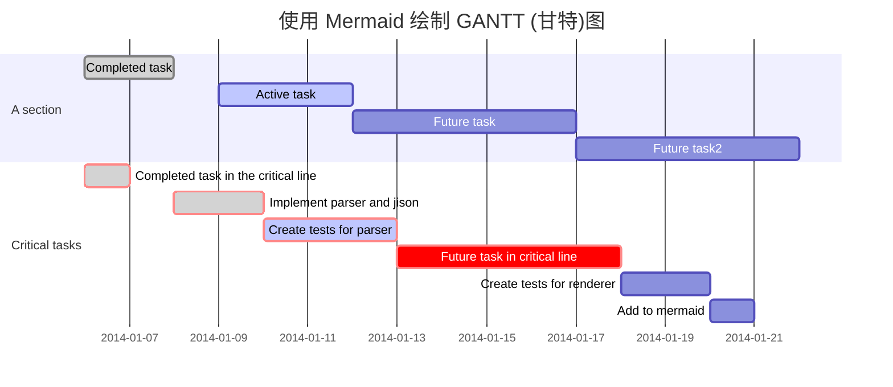
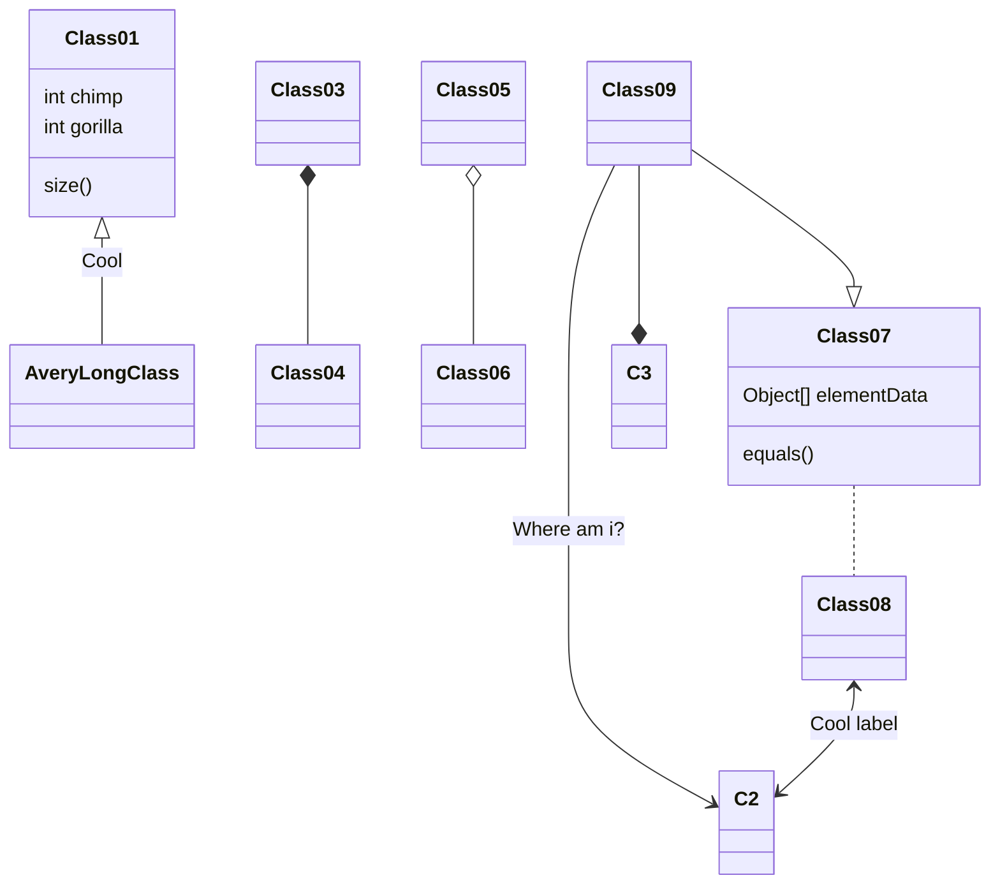
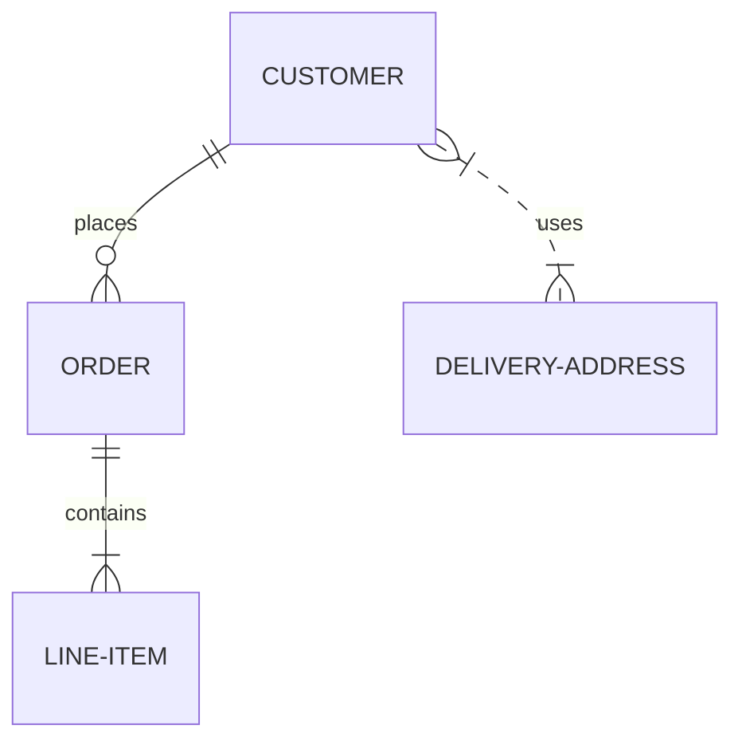
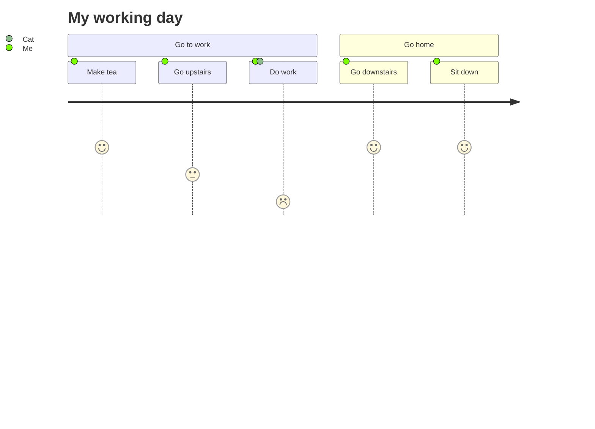
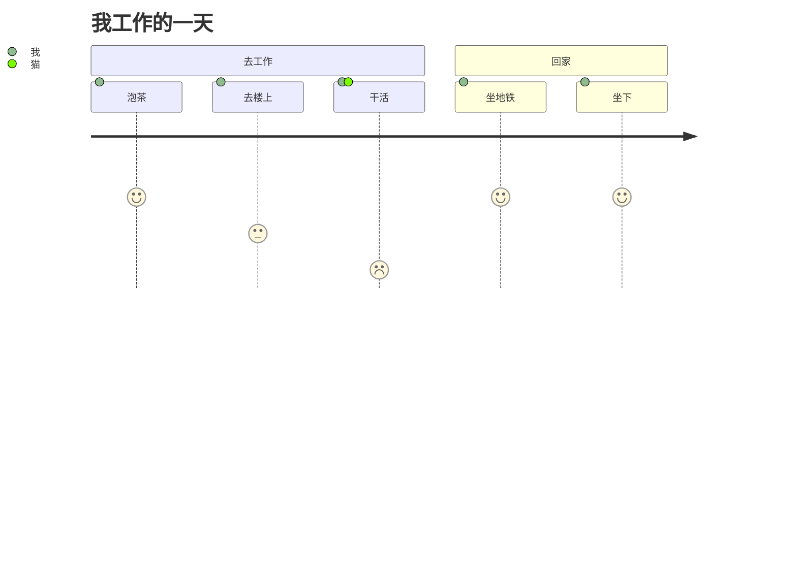

# Markdown常用语法

参考[MarkDown 语法手册（完整整理版）](https://blog.csdn.net/witnessai1/article/details/52551362 "CSDN-MarkDown语法手册")。

参考[MarkDown 书写风格指南](http://einverne.github.io/markdown-style-guide/zh.html#lint-tools "MarkDown 书写风格指南")

参考[图像](https://shd101wyy.github.io/markdown-preview-enhanced/#/zh-cn/diagrams "图像")

## 超链接

使用[]包含超链接展示内容，后接(url tips)格式即可，示例如上。

## 标题

使用#和空格即可。#-######分别表示1-6级标题(其中一级标题自带分隔线)。建议标题前后使用空行。

示例如下:

# 一级标题

## 二级标题

### 三级标题

#### 四级标题

##### 五级标题

###### 六级标题

####### 七级标题不存在^_^

***

## 分隔线

使用连续的三个星号(***)或减号(---)或下划线(___)即可，推荐使用星号。

示例如下

***

***

## 斜体

使用一对单星号(*)包起来即可

示例如下
*斜体*

***

## 加粗

使用一对双星号(**)包起来即可

示例如下
**加粗**

***

## 斜体加粗

使用一对三星号(***)包起来即可

示例如下
***斜体加粗***

***

## 删除线

使用一对双波浪号(~~)包起来即可

示例如下

~~删除体~~

***

## 代码块

* 使用两行反引号(```)包起来即可
* 使用一个空行和tab缩进亦可

示例如下

```Java
//Java
public class HelloWorld {
    //这是测试代码
    public static void main(String[] args) {
        System.out.println("Hello, Java World!");
    }
}
```

```JavaScript
//JavaScript
var username = document.getElementById("username");
function(toggle){
    alert(toggle);
}
```

    //空格和tab缩进代码块示例
    //由于没有代码语法规则，故不会高亮显示
    var x;
    function setValue(val) {
        x = val;
    }

***

## 无序列表

1. 使用一个星号(*)或减号(-)，推荐使用星号
2. 需要一个空格

示例如下

* 苹果
* 香蕉
* 橘子

***

## 有序列表

1. 使用数字
2. 需要一个英文句点
3. 需要一个空格

示例如下

1. 苹果
2. 香蕉
3. 橘子

***

## 混合列表

示例如下

1. 苹果
    * x
    * x
        1. x
        2. x
2. 香蕉
3. 橘子

* 多行情况的列表
  表示一条数据分多行显示

* 多行情况的列表
  包括层级列表

  * 层级列表
    * 可以通过缩进展示层级列表
    * 可以通过缩进展示层级列表
  * 层级列表
  * 层级列表

* 多行情况的列表

* 多行情况的列表

***

## 插入图片

类似于超链接，多个叹号

示例如下


## 数学公式

用一对美元符号($)包起来即可

示例如下

$E = mc$

## 插入表格

Before.

| h    | Long header |
|------|-------------|
| abc  | def         |
| abc2 | def2        |

After.

## UML

### 流程图

示例如下

    ```flow
    st=>start: Start
    e=>end: End
    op1=>operation: My Operation
    sub1=>subroutine: My Subroutine
    cond=>condition: Yes or No?
    io=>inputoutput: catch something...
    
    st->op1->cond
    cond(yes)->io->e
    cond(no)->sub1(right)->op1
    ```

```flow
st=>start: 开始
e=>end: 结束
op1=>operation: 步骤1
op2=>operation: 步骤2
op3=>operation: 步骤3
sub1=>subroutine: 分支1
sub2=>subroutine: 分支2
cond1=>condition: 条件判断1
cond2=>condition: 条件判断2
io=>inputoutput: 输入输出

st->op1->op2->cond1
cond1(yes)->op3->io->e
cond1(no)->sub1(right)->cond2
cond2(yes)->op1
cond2(no)->op2
```

### 时序图

示例如下

- sequence

    ```sequence {theme="hand}
    Title: Dialog
    Andrew->China: Says Hello
    Note right of China: China thinks\nabout it
    China-->Andrew: How are you?
    Andrew->>China: I am good, thinks!
    ```

```sequence
Title: 工作管理时序图
Note right of Web Browser: http request
Web Browser->Proxy Server: /work/list/item.do\n?pageSize=20&pageNum=1
Note right of Proxy Server: Attributes&Parameters
Proxy Server-->Tomcat: PagerContext.setPageSize\nPagerContext.setPageNum
Note left of Tomcat: PagerHelper
Tomcat-->Proxy Server: return pagerHelper
Note left of Proxy Server: json
Proxy Server->Web Browser: return items & total
Note left of Web Browser: http request
Web Browser->>Tomcat: /work/find/item.do\n?itemid=uuid
Note right of Tomcat: Map
Tomcat-->>Web Browser: return item & chains
```



- mermaid

````

````


### 甘特图

示例如下

````gantt

````




### 类图

````
```mermaid
Class01 <|-- AveryLongClass : Cool
Class03 *-- Class04
Class05 o-- Class06
Class07 .. Class08
Class09 --> C2 : Where am i?
Class09 --* C3
Class09 --|> Class07
Class07 : equals()
Class07 : Object[] elementData
Class01 : size()
Class01 : int chimp
Class01 : int gorilla
Class08 <--> C2: Cool label
```
````





### ER关系图

````

````


### 日程图

````

````





### ~~ditaa图~~

示例如下

    ```ditaa {cmd=true args=["-E"]}
    +--------+   +-------+    +-------+
    |        | --+ ditaa +--> |       |
    |  Text  |   +-------+    |diagram|
    |Document|   |!magic!|    |       |
    |     {d}|   |       |    |       |
    +---+----+   +-------+    +-------+
        :                         ^
        |       Lots of work      |
        +-------------------------+
    ```

```ditaa {cmd=true args=["-E"]}
  +--------+   +-------+    +-------+
  |        | --+ ditaa +--> |       |
  |  Text  |   +-------+    |diagram|
  |Document|   |!magic!|    |       |
  |     {d}|   |       |    |       |
  +---+----+   +-------+    +-------+
      :                         ^
      |       Lots of work      |
      +-------------------------+
```

